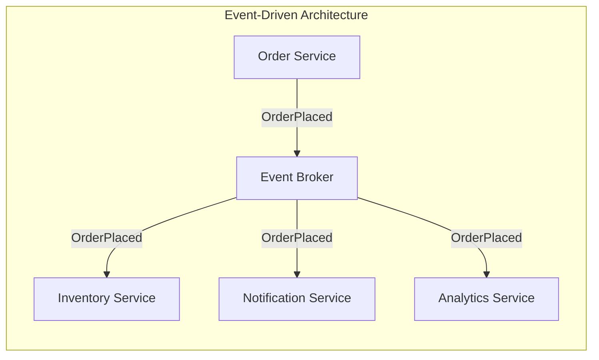
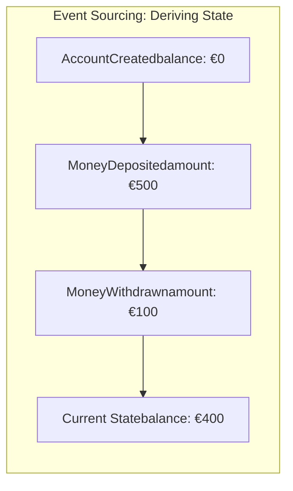
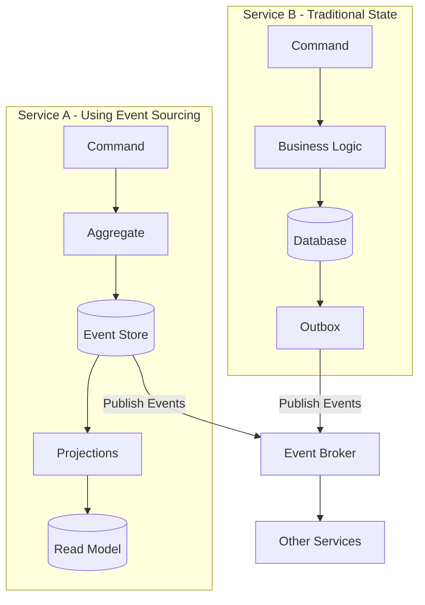
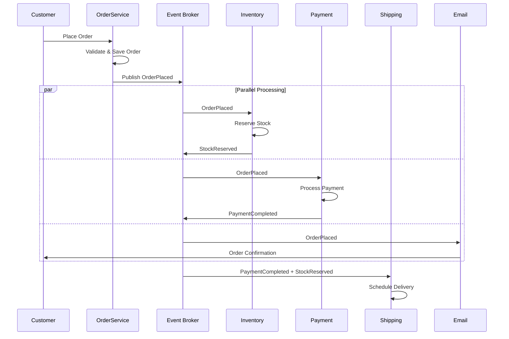
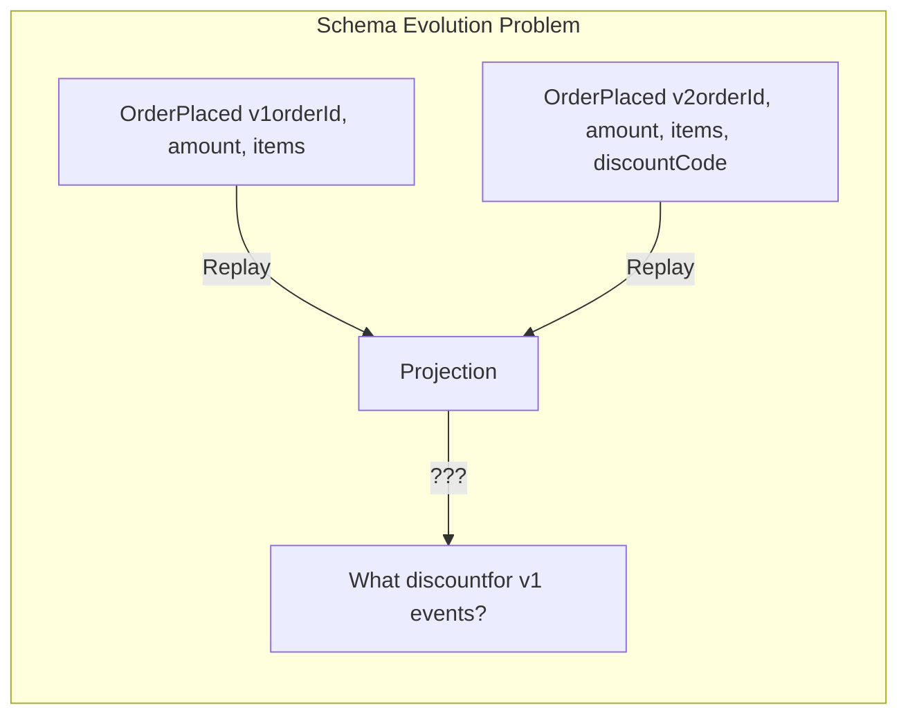
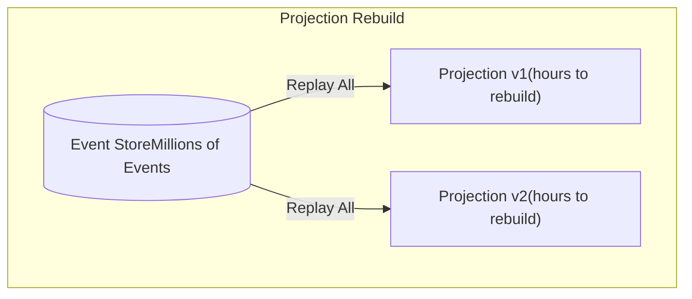
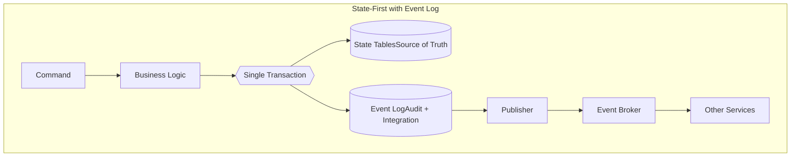

# Event-Driven Architecture Is Not Event Sourcing: A Necessary Distinction

There's a peculiar phenomenon in our industry. When someone says "we're building an event-driven system," I've learned to ask a follow-up question: "What do you mean by that?"

The answers vary dramatically. Some teams mean they're using a message broker for service communication. Others mean they're storing every state change as an immutable event. Still others mean both—often without realising these are fundamentally different architectural decisions with vastly different implications.

This conflation causes real harm. Teams adopt Event Sourcing because they want the benefits of Event-Driven Architecture, only to discover they've signed up for complexity they never needed. Let me try to untangle these concepts.

---

## What Event-Driven Architecture Actually Is

**Event-Driven Architecture (EDA)** is a communication pattern. It describes how components in a system talk to each other. 

In a traditional request-response model, Service A calls Service B directly and waits for an answer. They're coupled in time and in knowledge—A must know where B lives and what it expects.

In an event-driven model, something different happens:

The Order Service doesn't call the Inventory Service. It simply announces: "An order was placed." Anyone interested can listen. The Order Service neither knows nor cares who's listening. This is the essence of EDA: **decoupled communication through events**. 

Each service maintains its own database. Each service decides independently how to react to events. The event broker (Kafka, RabbitMQ, Amazon SNS) handles the plumbing.

---

## What Event Sourcing Actually Is

**Event Sourcing** is a persistence pattern. It describes how you store data. 

In traditional systems, you store current state. A customer has a balance of €500. When they withdraw €100, you update the balance to €400. The fact that a withdrawal occurred? Lost, unless you explicitly log it elsewhere.

In Event Sourcing, you don't store current state at all. You store the sequence of events that led to the current state:

To know the current balance, you replay all events from the beginning. The event stream *is* the source of truth. 

This is a fundamentally different proposition. EDA is about how services communicate. Event Sourcing is about how a service persists its own data.

---

## The Architectural Picture

Let me illustrate how these patterns sit in a system:

Notice: both services can participate in Event-Driven Architecture. Service A uses Event Sourcing internally; Service B uses traditional state persistence. From the outside, both publish events to a broker. **The internal persistence strategy is orthogonal to the communication pattern.** 

You can have EDA without Event Sourcing. You can have Event Sourcing without EDA (though this is less common). They are independent choices.

---

## The Benefits of Event-Driven Architecture

EDA has earned its place in the architect's toolkit through genuine, practical benefits:

### Loose Coupling

When the Order Service publishes an `OrderPlaced` event, it doesn't need to know that the Notification Service exists. Tomorrow, you can add a Fraud Detection Service that also listens for orders. The Order Service remains unchanged. 

This is particularly powerful in large organisations where different teams own different services.

### Scalability

Event brokers like Kafka are designed to handle massive throughput. Consumers can scale independently based on their own load. If the Analytics Service falls behind, it can catch up at its own pace without affecting order processing. 

### Real-Time Responsiveness

In traditional polling architectures, clients ask "Has anything changed?" repeatedly. In event-driven systems, updates flow to interested parties as they happen. 

### A Concrete Example: E-Commerce Order Processing

Consider a typical e-commerce scenario:

Each service handles its own concern. They scale independently. If the email service is slow, payments still process. If you need to add a loyalty points service next quarter, you simply subscribe to the relevant events. 

This is EDA working as intended: decoupled, scalable, resilient.

---

## The Hidden Costs of Event Sourcing

Now let me turn to Event Sourcing—not to dismiss it entirely, but to illuminate costs that are often glossed over in introductory articles.

### The Complexity Is Not Incidental

Event Sourcing fundamentally changes how you work with data. Every query becomes a replay operation (unless you maintain separate read models). Every "simple" change becomes a consideration of event schema evolution. Every bug fix raises questions about what to do with historical events. 

Microsoft's own documentation states plainly: "The complexity that event sourcing adds to a system is not justified for most systems." 

### Problem 1: Schema Evolution

In traditional systems, adding a field to a database table is routine. In Event Sourcing, adding a field to an event is a design decision with long-term implications.

Suppose you have an `OrderPlaced` event. A year in, you need to add a `discount_code` field. What value should this field have for the million orders placed before the change? When you replay events to rebuild a projection, do old orders suddenly appear to have no discount? Or do they inherit some default that may not have existed when they were placed? 

Teams end up maintaining multiple event versions, upcasting old events to new formats, and building institutional knowledge about which versions mean what. This is manageable, but it's not free. 

### Problem 2: Projection Drift and Rebuild Pain

In Event Sourcing, read models (projections) are derived from events. When projections need to change—and they will—you must rebuild them from the event stream.

Dennis Doomen documents a case where a single event stream grew to 100,000+ events, and projection rebuilds became a serious performance bottleneck. 

You can mitigate this with snapshots, but snapshots are essentially... stored state. You're re-introducing the thing you were trying to avoid.

### Problem 3: The GDPR Paradox

Event Sourcing's selling point—immutable, complete history—becomes a liability when regulations demand data deletion.

GDPR's "right to be forgotten" requires you to delete personal data on request. But in Event Sourcing, events are immutable. You can't simply delete the `CustomerRegistered` event—other events depend on it, projections depend on it, the entire stream's integrity depends on it. 

Teams resort to crypto-shredding (encrypting personal data and destroying keys), event tombstones, or complex anonymisation schemes. Each approach has trade-offs and adds complexity.

### Problem 4: The Learning Curve Is Steep

An empirical study of event-sourced systems in production found that "the steep learning curve" was one of the five most consistently cited challenges. 

This isn't about intelligence—it's about the sheer number of new concepts: aggregates, projections, event versioning, idempotent handlers, eventual consistency, compensating events, snapshots. Each concept is learnable, but together they represent a significant cognitive load for teams.

### A Cautionary Example: The Unbounded Event Stream

Consider a financial data platform that chose Event Sourcing for a price-tracking system. Each price update became an event. With millions of price ticks daily across thousands of instruments, the event stream grew to terabytes.

Replaying events to rebuild projections became impractical—measured not in minutes but in hours. The team ended up implementing daily snapshots, essentially maintaining parallel state stores, negating much of Event Sourcing's theoretical benefit while retaining its complexity. 

---

## When Does Event Sourcing Make Sense?

I'm not arguing that Event Sourcing is never appropriate. It genuinely shines in specific contexts:

- **When the event history *is* the domain**: Version control systems, collaborative editing, trading platforms where the sequence of operations is the business logic.
- **When temporal queries are a primary use case**: "What was this account's state on March 15th?" is a business-critical question asked frequently, not a rare audit need.
- **When regulatory requirements mandate complete history**: Some financial or legal domains require provable, immutable records.

Even then, consider applying Event Sourcing to specific bounded contexts rather than the entire system. 

---

## The Pragmatic Middle Ground

For most systems, there's a simpler approach that captures many benefits without the costs:

**Store state as state.** Your `accounts` table holds current balances. Queries are fast and consistent.

**Log events alongside state changes.** In the same transaction, append an event to an outbox table. You get immutable audit history and integration capability.

**Publish events for EDA.** A separate process reads the outbox and publishes to your broker.

This gives you:

- Strong consistency for reads
- Complete audit trail, immutable & signed if you need
- Event-driven integration with other services
- The option to build eventually-consistent read models where valuable

You lose the ability to derive state purely from events—but you probably didn't need that anyway.

---

## Conclusion

The distinction between Event-Driven Architecture and Event Sourcing matters because conflating them leads to poor architectural decisions.

**Event-Driven Architecture** is about communication. It's a proven pattern for building scalable, decoupled systems. Most organisations can benefit from it.

**Event Sourcing** is about persistence. It's a specialised pattern with genuine benefits in specific contexts and significant costs in all contexts. Most organisations should not adopt it without clear, concrete requirements that justify the complexity.

When someone proposes Event Sourcing, ask: "What specific problem does this solve for us?" If the answer is "complete audit history," an event log solves that. If the answer is "we want events for integration," EDA solves that without Event Sourcing. If the answer is "everyone's doing it" or "it seems modern," that's not a requirement—it's a trend.

Build the simplest thing that meets your actual needs. You can always add complexity later; removing it is much harder.

---

*The best architecture is the one that solves your actual problems with the minimum necessary complexity. Everything else is borrowing trouble from your future self.*
